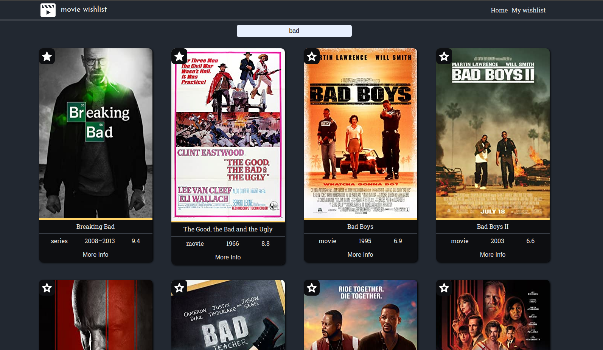

# Movie wishlist

> Simple apllication to search movies and create own wishlist of movies (based on cookies)
> Live demo [_here_](https://mj-movie-wishlist.netlify.app).

## Table of Contents

- [General Info](#general-information)
- [Technologies Used](#technologies-used)
- [Features](#features)
- [Screenshots](#screenshots)
- [Project Status](#project-status)

<!-- * [License](#license) -->

## General Information

- Simple apllication to search movies and create own wishlist of movies
- Application gets data from http://www.omdbapi.com
- Simple persistent wishlist created using cookies
<!-- You don't have to answer all the questions - just the ones relevant to your project. -->

## Technologies Used

- React
- SASS
- npm : React-router, React-cookies, React-responsive-pagination, React-Scroll, Reactjs-popup

## Features

List the ready features here:

- Search movies by title
- Add/Delete movie from wishlist
- Delete all items from wishlist
- Popup with more information about movie

## Screenshots

## Project Status

Project is: _complete_
